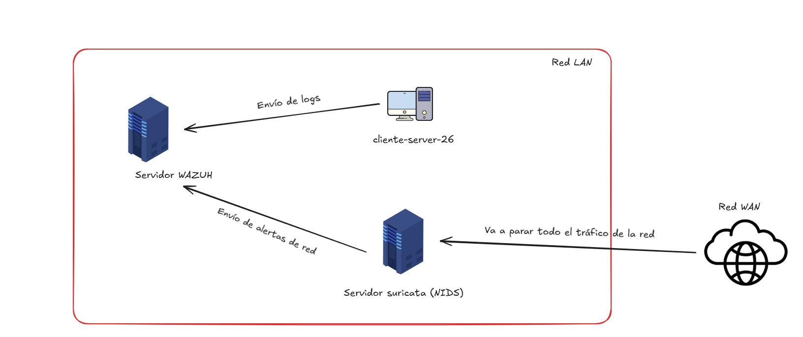
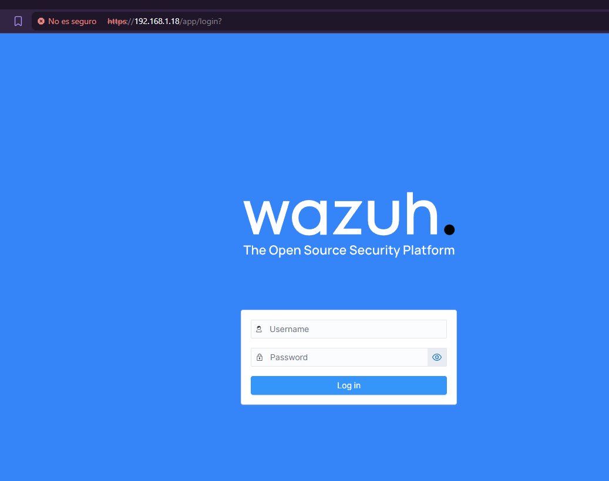
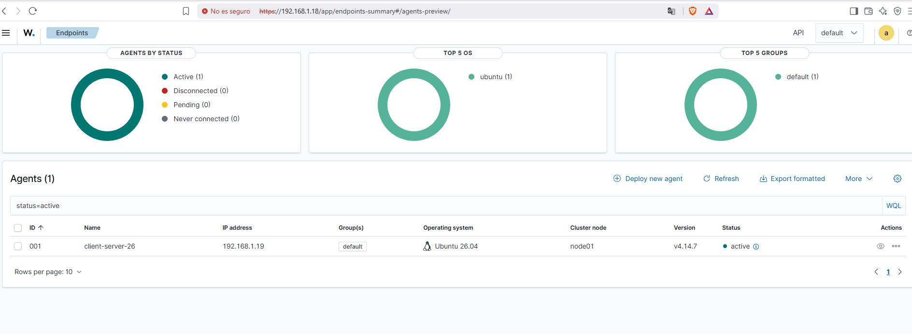
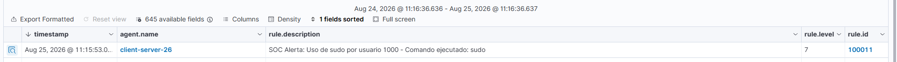
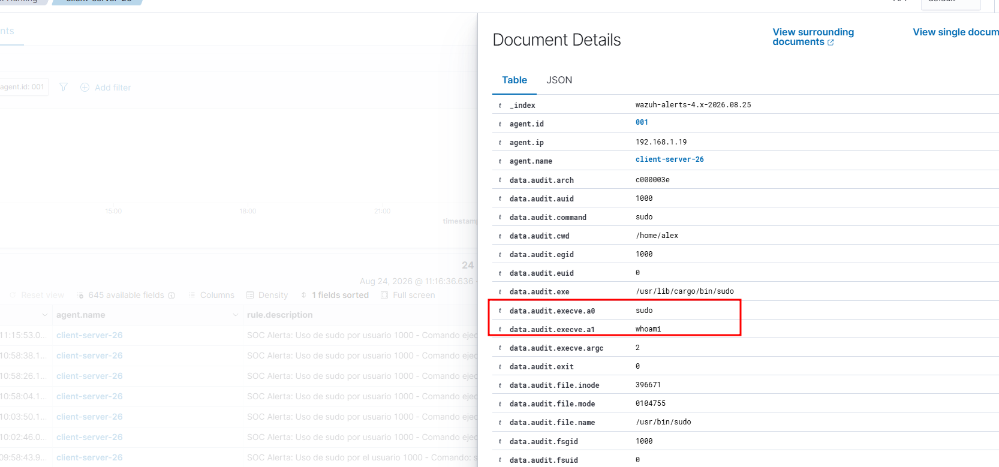
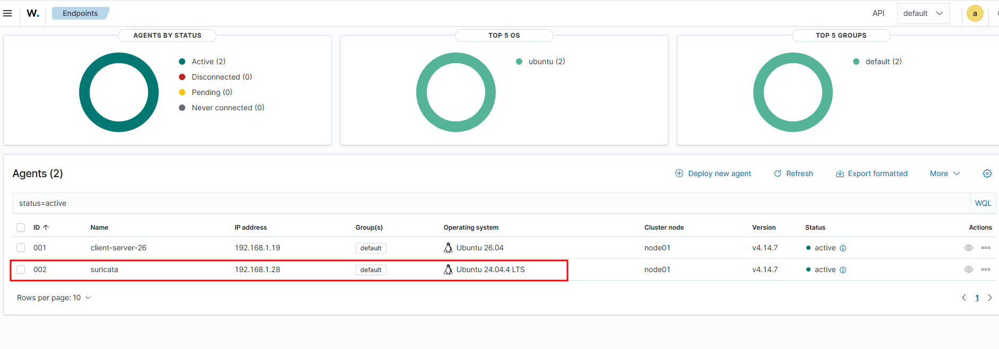
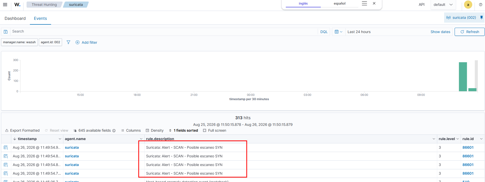
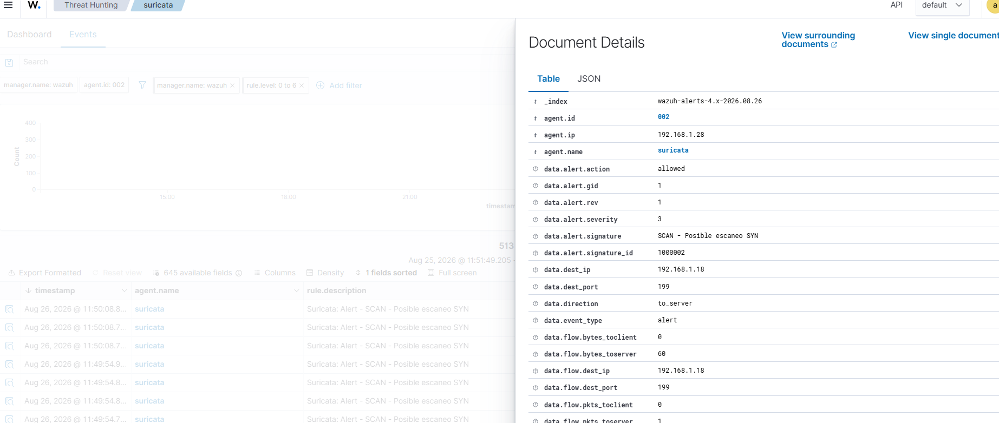

# SOC & SIEM Lab: Implementación de Wazuh, Auditd y Suricata NIDS

En este proyecto práctico de ciberseguridad, he querido enfocarme en la implementación de un entorno de monitorización centralizado (SIEM) para la detección de eventos anómalos dentro de una red empresarial. Aparte de esto, en otra máquina, he decidido instalar el servicio de Suricata para que actúe como NIDS.

---

## Arquitectura del Laboratorio

He utilizado el software de virtualización VirtualBox para recrear este laboratorio práctico.

| Host | Rol en la Red | Sistema Operativo | Componentes Principales |
| :--- | :--- | :--- | :--- |
| `wazuh-server` | Servidor SIEM Central | Linux | Wazuh Manager, Wazuh Indexer, Dashboard |
| `client-server-26` | Endpoint Monitorizado | Linux | Wazuh Agent, Auditd |
| `suricata-sensor` | Sensor de Red (NIDS) | Linux | Suricata (Modo Promiscuo), Wazuh Agent |

---

Todas las máquinas virtuales están configuradas con el adaptador de red en modo adaptador puente, de forma que puedan utilizar la red real de mi equipo anfitrión. De esta manera, se consigue simular un entorno de red más realista y cercano a un escenario práctico.

El esquema del entorno sería similar al siguiente:



## Fase 1: Auditoría de Sistema con Wazuh

El primer paso para montar este laboratorio ha sido instalar el servicio Wazuh. Este está formado por 3 servicios:

* **Wazuh Manager:** Es el componente que se encarga de controlar, recibir, analizar y correlacionar los logs enviados por los agentes.
* **Wazuh Indexer:** Este componente se encarga de transformar los logs recibidos por el Manager y los parsea de forma estructurada e indexada para poder realizar consultas.
* **Wazuh Dashboard:** Nos permite visualizar los logs de una forma más gráfica, con estadísticas.

La instalación de Wazuh la he realizado utilizando el siguiente comando:

```bash
curl -sO https://packages.wazuh.com/4.14/wazuh-install.sh && sudo bash ./wazuh-install.sh -a
```



### Instalación de wazuh-agent

El siguiente paso es añadir un cliente a nuestro servicio de Wazuh, ya que los logs que encontraremos únicamente serán los del propio servidor.

En este caso, como he comentado antes, utilizaremos un servidor Ubuntu 26 que hará de cliente.

Para instalar el agente, deberemos instalar el paquete `wazuh-agent` en la máquina cliente. Para hacer esto, primero añadimos a los repositorios de Ubuntu el propio repositorio de Wazuh para poder descargar el paquete:

```bash
curl -s https://packages.wazuh.com/key/GPG-KEY-WAZUH | gpg --no-default-keyring --keyring gnupg-ring:/usr/share/keyrings/wazuh.gpg --import && chmod 644 /usr/share/keyrings/wazuh.gpg
```

```bash
echo "deb [signed-by=/usr/share/keyrings/wazuh.gpg] https://packages.wazuh.com/4.x/apt/ stable main" | tee -a /etc/apt/sources.list.d/wazuh.list
```

```bash
apt-get update
```

Tras hacer esto, ya tendríamos añadido el repositorio. Solo quedaría instalar el agente con el siguiente comando:

```bash
WAZUH_MANAGER="192.168.1.18" apt-get install wazuh-agent
```

`WAZUH_MANAGER` es una variable que utilizamos para indicarle al agente a dónde debe enviar los datos.

Por último, debemos recargar los servicios de Linux y habilitar el servicio Wazuh Agent en el cliente:

```bash
systemctl daemon-reload
systemctl enable wazuh-agent
systemctl start wazuh-agent
```



### Creación de reglas personalizadas

En este punto, ya tendríamos nuestro servidor Wazuh funcionando con la configuración predeterminada y un conjunto de reglas capaces de alertarnos sobre comportamientos anómalos. Sin embargo, esta configuración por defecto no permite detectar determinadas acciones.

Por ello, para el entorno de laboratorio, he decidido crear una nueva regla dentro del servidor Wazuh que permita ampliar las capacidades de monitorización y detección.

El primer paso consiste en instalar el servicio Auditd en Linux. Este servicio permite registrar de forma más detallada las acciones que se llevan a cabo en el sistema, proporcionando información que, por sí sola, puede no quedar suficientemente reflejada en los registros habituales.

Esto es debido a que el procesamiento de los logs lo efectúa el kernel, y no los servicios o daemons del sistema, como ocurre con `syslog` o `journalctl`. Gracias a este servicio conseguimos que los logs se vuelquen en un fichero de log para poder tratarlos y verlos con más detalle.

```bash
sudo apt install auditd audispd-plugins
sudo systemctl start auditd
```

El siguiente paso sería crear una nueva regla dentro del servicio Auditd. Esta regla nos servirá para poder indicarle al kernel qué logs debe escribir en `/var/log/audit.log`. Como hemos comentado previamente, los logs que se escriban en ese fichero serán mucho más extensos y detallados.

Para crear la regla, creamos un nuevo fichero dentro del directorio del servicio Audit:

```bash
nano /etc/audit/audit.rules
```

Y en su interior ponemos la siguiente regla:

```text
## This file is automatically generated from /etc/audit/rules.d
-D
-b 8192
-f 1

--backlog_wait_time 60000
-w /usr/bin/sudo -p x -k privilege_escalation
-w /etc/sudoers -p wa -k privilege_escalation
```

El significado de las líneas es el siguiente:

Estas dos líneas relacionadas con `/usr/bin/sudo` generan un evento de auditoría cada vez que un usuario invoca o ejecuta el binario `sudo`, registrando cualquier intento de ejecución de comandos con privilegios elevados. Mientras que la última línea, `/etc/sudoers`, registra un log si se intenta modificar, escribir o alterar el archivo de configuración, garantizando la detección de cambios no autorizados en las políticas del sistema.

En este caso, el nombre de la regla es `privilege_escalation`.

Ahora simplemente quedaría crear la regla dentro de Wazuh, ya que lo único que hemos hecho es indicarle que queremos que nos genere un log cuando ocurren estas acciones, pero dentro del programa de Wazuh no veremos nada.

Dentro del agente de Wazuh que hemos instalado en el cliente, le tenemos que indicar que lea el contenido del log que genera el servicio de Auditd. En este caso, esta es su ruta: `/var/log/audit/audit.log`.

```bash
nano /var/ossec/etc/ossec.conf
```

Deberemos añadir la línea de `localfile` para que lea el contenido de ese log:

```xml
<localfile>
  <log_format>audit</log_format>
  <location>/var/log/audit/audit.log</location>
</localfile>
```

Tras hacer esto, reiniciamos el servicio de `wazuh-agent`:

```bash
sudo systemctl restart wazuh-agent
```

En el servidor, deberemos crear la nueva alerta, indicando el ID y su nivel de peligrosidad. Como hemos comentado, queremos que salte cuando se ejecuta cualquier comando con `sudo`:

```bash
sudo nano /var/ossec/etc/rules/local_rules.xml
```

```xml
<group name="audit,syslog,">
  <rule id="100011" level="7">
    <if_sid>80700</if_sid>
    <field name="audit.type">SYSCALL</field>
    <field name="audit.exe">sudo$</field>
    <description>SOC Alerta: Uso de sudo por usuario $(audit.auid) - Comando ejecutado: $(audit.command)</description>
    <group>audit,privilege_escalation,sudo_usage,</group>
  </rule>
</group>
```

Una vez realizados todos estos cambios, reiniciamos el servicio de Wazuh para que los cambios se apliquen:

```bash
systemctl restart wazuh-manager
systemctl restart wazuh-indexer
systemctl restart wazuh-dashboard
```

Ahora sí que veremos cómo, si ejecutamos en el cliente un comando con `sudo`, se verá reflejado dentro del panel.




---

### Configuración de FIM (File Integrity Monitoring)

Una vez que ya tenemos configuradas las alertas para que, en el momento en que alguien ejecute algún comando con `sudo`, llegue la alerta a nuestro Wazuh, también es interesante tener un registro de ciertas modificaciones de ficheros. Para esto, tenemos dentro de Wazuh un módulo llamado File Integrity Monitoring.

Para configurarlo, simplemente tendremos que ir al agente Wazuh del cliente y añadir los directorios que queramos monitorizar.

La ruta donde tenemos que modificar el agente de Wazuh es la siguiente:

```bash
sudo nano /var/ossec/etc/ossec.conf
```

Dentro de la sección `syscheck`, deberemos añadir todos los directorios que queremos monitorizar. En este caso, he puesto que nos avise cuando se modifique cualquier fichero del directorio `/etc`.

Debería quedar de la siguiente forma:

```xml
<syscheck>
    <disabled>no</disabled>

    <!-- Frequency that syscheck is executed default every 12 hours -->
    <frequency>43200</frequency>

    <scan_on_start>yes</scan_on_start>

    <!-- Directories to check (default) -->
    <directories>/usr/bin,/usr/sbin</directories>
    <directories>/bin,/sbin,/boot</directories>
    
    <!-- Directorio a monitorizar -->
    <directories check_all="yes" report_changes="yes" realtime="yes">/etc</directories>
</syscheck>
```

Esta configuración indica a Wazuh que supervise el directorio `/etc` para detectar modificaciones en sus archivos.

* `check_all="yes"`: comprueba todos los atributos disponibles de los archivos, como permisos, propietario, tamaño, fechas y hash.
* `report_changes="yes"`: informa del contenido que ha cambiado cuando sea posible.
* `realtime="yes"`: activa la monitorización en tiempo real, permitiendo detectar los cambios inmediatamente en lugar de esperar al siguiente análisis programado.

## Fase 2: Configuración de NIDS

Un NIDS (Network Intrusion Detection System) es un sistema encargado de monitorizar y analizar el tráfico de red en busca de patrones anómalos o comportamientos que puedan indicar un ataque o intento de intrusión.

El principal objetivo de este sistema a implantar es:

* Detectar y actuar para prevenir o detener la amenaza.

### Implementación de Suricata

Para crear nuestro NIDS, utilizaremos un software llamado Suricata, que está especializado en la creación de reglas para notificar y actuar ante cualquier intrusión en nuestro sistema a nivel de red.

Lo ideal sería implementar el IDS/IPS directamente en el router o firewall, ya que es el punto por el que pasa gran parte del tráfico entrante y saliente de la red. De esta forma, Suricata podría analizar el tráfico antes de que llegue a los dispositivos internos.

Sin embargo, debido a que el router disponible no tiene suficiente capacidad para ejecutar este servicio, se optará por desplegar Suricata en una máquina virtual independiente.

La interfaz de red de esta máquina virtual se configurará en modo promiscuo, permitiendo que la interfaz pueda recibir paquetes destinados a otros dispositivos y no únicamente los dirigidos a la propia máquina.

Primero de todo, deberemos poner la tarjeta dentro de la MV en modo promiscuo:


Tras configurar la tarjeta de red de la MV a nivel de hipervisor, toca hacer lo mismo dentro del sistema operativo. Utilizamos el siguiente comando:

```bash
sudo ip link set dev <tu_interfaz> promisc on
```

Para comprobar que está funcionando el modo promiscuo, con `tcpdump` podemos ponernos en escucha y excluir la IP de la máquina Suricata para ver si se está generando tráfico. En caso de ver tráfico, indica que está funcionando correctamente.

```bash
sudo tcpdump -i enp0s3 not host 192.168.1.28
```

##### Instalación y configuración del servicio Suricata

Para instalar el servicio de Suricata, tendremos que poner el siguiente comando:

```bash
sudo apt update
sudo apt install suricata -y
```

El siguiente paso consiste en indicarle a Suricata en qué interfaz de red debe escuchar. El fichero a modificar es `/etc/suricata/suricata.yaml`.

```yaml
af-packet:
  - interface: enp0s3
```

Al estar utilizando una máquina Ubuntu, la interfaz por la que debemos escuchar es `enp0s3`, aunque puede variar dependiendo de la distribución.

Tras realizar estas modificaciones, también debemos configurar dos variables que utilizaremos posteriormente a la hora de crear las reglas de Suricata:

* **HOME_NET:** Define la red interna que queremos monitorizar. Aquí debemos especificar el rango de direcciones IP correspondiente a nuestra red local.
* **EXTERNAL_NET:** Define las redes externas a nuestra red interna. Normalmente se configura como cualquier red que no pertenezca a `HOME_NET`.

Debe quedar de la siguiente forma:

```yaml
vars:
  # more specific is better for alert accuracy and performance
  address-groups:
    HOME_NET: "[192.168.1.0/24]"
    EXTERNAL_NET: "!$HOME_NET"
```

El siguiente paso consiste en descargar las reglas de Suricata, que utilizaremos posteriormente para detectar diferentes tipos de amenazas y comportamientos sospechosos en el tráfico de red.

El siguiente comando se encarga de descargar las reglas proporcionadas por la comunidad y, además, comprobar la sintaxis de los archivos de configuración de Suricata, permitiéndonos detectar posibles errores de configuración antes de iniciar el servicio.

```bash
sudo suricata-update
```

Tras hacer estas modificaciones, reiniciamos el servicio de Suricata:

```bash
systemctl restart suricata
```

##### Creación de reglas personalizadas

Una vez tenemos Suricata instalado y funcionando, debemos crear nuestras reglas personalizadas. Aunque la importación de reglas realizada anteriormente nos permite detectar y reportar una gran variedad de amenazas, no todas ellas tienen por qué ser relevantes para nuestra infraestructura.

Por este motivo, resulta útil crear un conjunto de reglas adaptadas a nuestro entorno, que nos permitan detectar comportamientos específicos y reducir el número de alertas innecesarias.

Para escribir reglas personalizadas en Suricata, se deben escribir dentro de un archivo `.rules`, pero antes de crear este archivo, deberemos saber en qué directorio crearlas e indicarle a Suricata que lea las reglas de ese fichero. Por defecto, lee las reglas únicamente de `suricata.rules`.

El fichero debe quedar de la siguiente forma:

```yaml
default-rule-path: /var/lib/suricata/rules

rule-files:
  - custom.rules
```

Ahora sí, creamos el fichero de las reglas personalizadas dentro del directorio y con el nombre `custom.rules`:

```bash
sudo nano /var/lib/suricata/rules/custom.rules
```

* **Reglas ICMP > Servidor WAZUH**

```text
alert icmp any any -> 192.168.1.18 any (msg:"Trafico ICMP - Ping Detectado a WAZUH"; sid:1000001; rev:1;)
```

* **Acción (`alert`):** Indica a Suricata que genere una alerta en `eve.json` cuando coincida el tráfico.
* **Protocolo (`icmp`):** El tipo de tráfico a auditar (TCP, UDP, ICMP, HTTP, etc.).
* **Origen y destino (`any any -> any any`):** Desde cualquier IP y puerto de origen hacia el servidor Wazuh y puerto de destino.
* **Opciones (entre paréntesis):**
  * `msg`: El texto que aparecerá en los logs para describir la alerta.
  * `sid`: El identificador único de la regla (Signature ID). Las reglas personalizadas deben usar números a partir del 1000000.
  * `rev`: La versión o revisión de la regla (inicia en 1).

Tras hacer esta modificación, deberemos reiniciar el servicio:

```bash
sudo systemctl restart suricata
```

Una vez hecho todo esto, dentro del fichero de log veremos que aparece el registro del ping:

```bash
alex@suricata:~$ cat /var/log/suricata/fast.log

08/26/2026-08:58:47.691525  [**] [1:1000001:1] Trafico ICMP - Ping Detectado a WAZUH [**] [Classification: (null)] [Priority: 3] {ICMP} 192.168.1.19:8 -> 192.168.1.18:0
```

* **Reglas de bloqueo y notificación de escaneo de puertos**

Una vez hemos creado la regla de ping, que utilizamos para comprobar que el fichero de reglas funciona correctamente, podemos crear una regla más útil y orientada a la seguridad de nuestra infraestructura.

En este caso, crearemos una regla destinada a detectar y bloquear los intentos de escaneo de puertos. De esta forma, Suricata nos notificará cuando un equipo realice este tipo de actividad y, al estar configurado en modo IPS, podrá bloquear el tráfico correspondiente, dificultando el reconocimiento de los servicios expuestos en nuestra red y ayudando a prevenir posibles intentos de intrusión.

La regla tendrá que ser la siguiente:

```text
drop tcp any any -> $HOME_NET any (msg:"SCAN - Posible escaneo SYN"; flags:S; threshold:type limit, track by_src, count 1, seconds 3600; sid:1000002; rev:3;)
```

* `drop`: indica la acción que debe realizar Suricata. Si está funcionando en modo IPS, descartará el paquete que coincida con la regla y, por tanto, bloqueará ese tráfico.
* `tcp`: la regla se aplica únicamente a tráfico del protocolo TCP.
* `any any`: el origen puede ser cualquier dirección IP y cualquier puerto.
* `$HOME_NET any`: el destino debe ser una dirección perteneciente a nuestra red interna (`HOME_NET`) y puede utilizar cualquier puerto.
* `flags:S`: busca paquetes TCP que tengan activada la bandera SYN. Los paquetes SYN se utilizan normalmente para iniciar una conexión TCP, en base al three-way handshake.
* `threshold:type limit`: establece el límite de alertas que puede generar la regla. En este caso, indicamos que, como máximo, genere una alerta durante el período definido, que es de 3600 segundos.
* `track by_src`: contabiliza los paquetes según la IP de origen.

Ahora, si realizamos un escaneo de puertos, veremos que dentro del log aparece la alerta indicando que nos están escaneando los puertos:

```bash
alex@suricata:~$ tail -f /var/log/suricata/fast.log

08/26/2026-08:58:47.691525  [**] [1:1000001:1] Trafico ICMP - Ping Detectado a WAZUH [**] [Classification: (null)] [Priority: 3] {ICMP} 192.168.1.19:8 -> 192.168.1.18:0

08/26/2026-09:13:48.586530  [wDrop] [**] [1:1000002:1] SCAN - Posible escaneo SYN [**] [Classification: (null)] [Priority: 3] {TCP} 192.168.1.19:53815 -> 192.168.1.18:23
```

Ahora el siguiente paso sería, por ejemplo, mediante un script e `iptables`, poner esas IP en una lista negra y bloquearles el tráfico hacia nuestra red por seguridad.

---

## Fase 3: Conectar Suricata con Wazuh

Para hacer esto, en primer lugar, deberemos conectar nuestro servidor Suricata e instalarle el agente de Wazuh.



Tras hacer esto, debemos hacer que el agente de Wazuh lea y envíe la información del directorio `fast.log` a Wazuh.

```bash
sudo nano /var/ossec/etc/ossec.conf
```

Dentro de este fichero, deberemos añadir la siguiente línea:

En este caso, utilizamos la salida del log en formato JSON, ya que el formato `fast.log` no lo interpreta bien Wazuh.

```xml
<localfile>
  <log_format>syslog</log_format>
  <location>/var/log/suricata/eve.json</location>
</localfile>
```

Reiniciamos el servicio de Wazuh Agent:

```bash
systemctl restart wazuh-agent
```

Ahora creamos la alerta dentro del servidor Wazuh, como hicimos anteriormente con el comando `sudo`, para que nos muestre en el panel cuándo alguien está haciendo un escaneo:

```bash
sudo nano /var/ossec/etc/rules/local_rules.xml
```

```xml
<group name="suricata,">
    <rule id="100100" level="10">
        <field name="event_type">alert</field>
        <field name="alert.signature_id">1000002</field>
        <description>Suricata: posible escaneo SYN detectado</description>
    </rule>
</group>
```

Tras esto, reiniciamos el componente Manager del servidor Wazuh:

```bash
sudo systemctl restart wazuh-manager
```

Tras hacer esto, si hacemos un escaneo de puertos dentro de nuestra red local, debería aparecer la regla en nuestro panel de Wazuh, tal y como se ve en la imagen:


